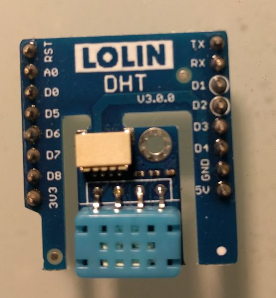
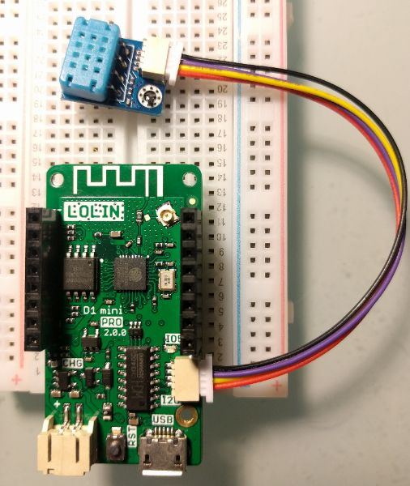

# micropython_dht12
super simple example use of dht12 temperature humidity sensor on the [esp8266 port of micropython](https://micropython.org/download#esp8266)
  i used the [lolin esp8266  D1 mini pro board](https://wiki.wemos.cc/products:d1:d1_mini_pro) and the [dht12 shield](https://wiki.wemos.cc/products:d1_mini_shields:dht_shield)
  
it has a handy i2c cable allowing the sensor to be positioned away from the (heat producing) chips
  
dht12 library module is from [Mike](https://github.com/mcauser/micropython-dht12) I think

